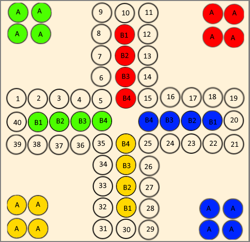
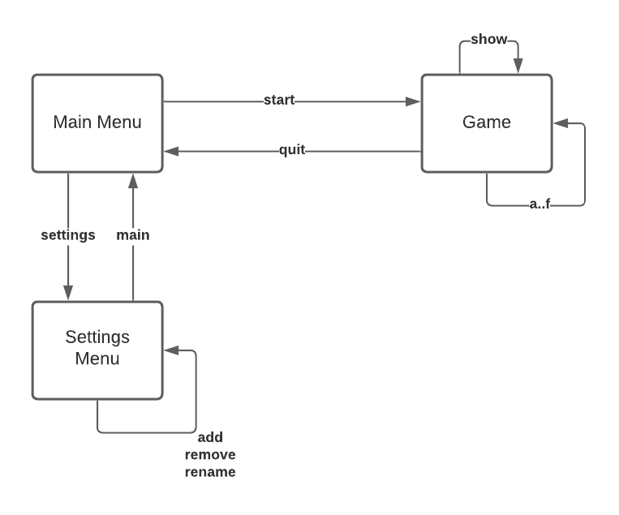
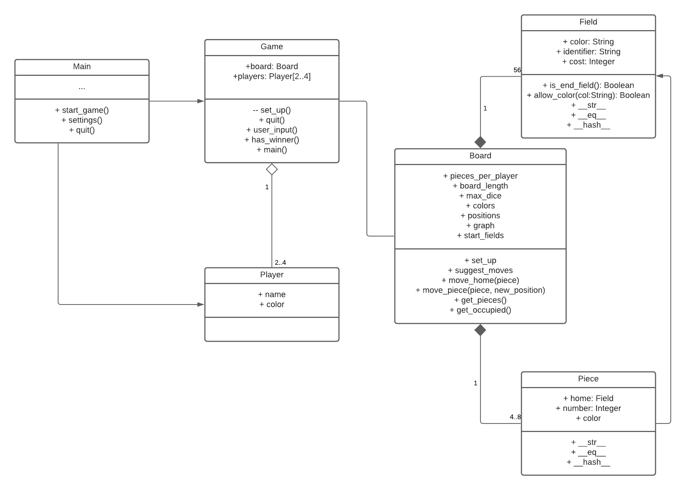

# Mensch ärgere dich nicht
This is an implementation of the classic German board game 'Mensch ärgere dich nicht'.
The game can be played with two to four players.

Here is a figure of the board:

Green starts with one piece on field 1, red on 11, blue on 21, and yellow on 31.
The players take turns rolling a dice and moving pieces forward.

Pieces can't go backwards. No two pieces may use the same field.

If a player moves their piece on a field with an opponents piece, the opponends piece moves to A.
This is called beating.

A player needs a six to leave an A field.
The goal is to move all four pieces on the B fields.

# Command Line Interface
Here is a flow chart for the application.

Player colors are assigned automatically.
There is no option for changing the order in which the players take turns.

The game uses a command line interface.
Here is a table of all available commands:

| syntax                            | where           | description         | example           |
|:---                               |     :----:      |    :----:           |   ---:            |
| start                             | Menu            | start game          | start             |
| quit                              | Menu            | end game            | quit              |
| add \<name\>                      | Settings        | add a player        | add Paul          |
| rename \<old_name\> \<new_name\>  | Settings        | rename player       | rename Paul Peter |
| remove \<name\>                   | Settings        | remove player       | remove Peter      |
| show                              | Settings        | prints players      | show              |
| a...h                             | Game            | pick an option      | b                 |
| quit                              | Game            | go to menu          | quit              |
| show                              | Game            | print all positions | show              |

# Technical Documentation

The program only uses Python the standard library and pytest for testing.

This is what the classes look like (roughly).

